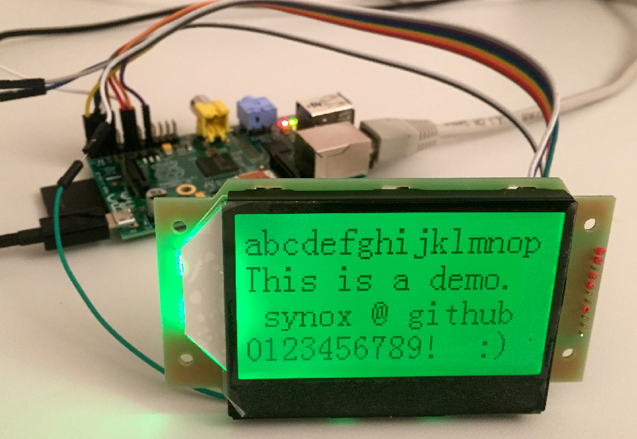
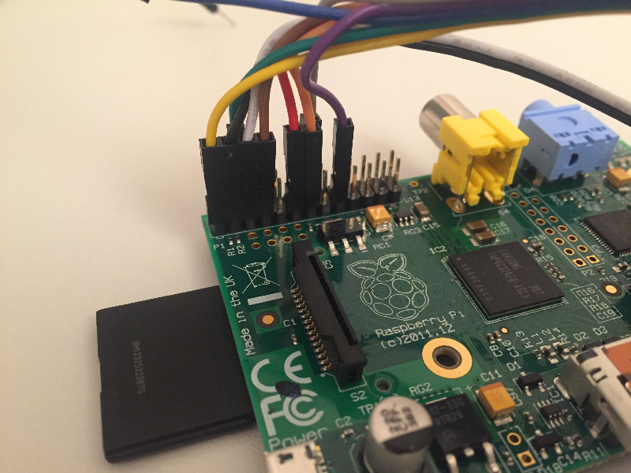
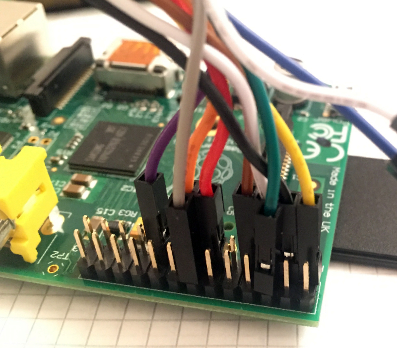

# Graphic ST7565 LCD Display with Python (on Raspberry Pi)

This guide shows you how to connect the [Graphic ST7565 Positive LCD (128x64) from Adafruit](https://www.adafruit.com/products/250) to the Raspberry Pi (1 or 2) and control it with Python. The provided script is very simple and works as a proof of concept.

I created this guide because I could not find a complete guide how to use the ST7565 with python.

## Connecting the wires

1. Solder wires to the LCD
2. Connect the wires with the Raspberry Pi:

| LCD Pin | Raspberry Pi Pin Name (GPIO.BCM) | Raspberry Pi Pin Number |
|-----| |-----| |-----|
| CS| BCM 2 | 3 |
| RST| BCM 3 | 5 |
| A0| BCM 4 | 7 |
| CLK| BCM 27 | 13 |
| SI| BCM 17 | 11 |
| VDD| 3.3V | 1 |
| GND| GND | 6 |
| R- | (not tested) | - |
| A+ | 3.3V  | 1 |
| G- | (not tested) | - |
| B- | (not tested) | - |

See the position of the Pins at http://pinout.xyz/.

## Installing requirements
The Raspbian operating system provides the required python binary and the [Rpi.GPIO Module] (https://sourceforge.net/projects/raspberry-gpio-python/).

## Python software
Copy the python file [display.py](display.py) to the Raspberry Pi and run it. Extend the script. It is very simple and just a proof of work. The script is based on the Forum discussion at https://www.raspberrypi.org/forums/viewtopic.php?f=32&t=25029

You might want to try as well:
- https://github.com/MaliceWitch/ST7565-Pi-Python
- https://github.com/larsks/py-st7565

### Specification
If you with to develop it further, you should look at the specification: https://cdn-shop.adafruit.com/product-files/250/TG12864H3-04MA0_A00.pdf  

## Further reading
 - http://www.ladyada.net/learn/lcd/st7565.html
 - C Code for Arduino: https://github.com/adafruit/ST7565-LCD
